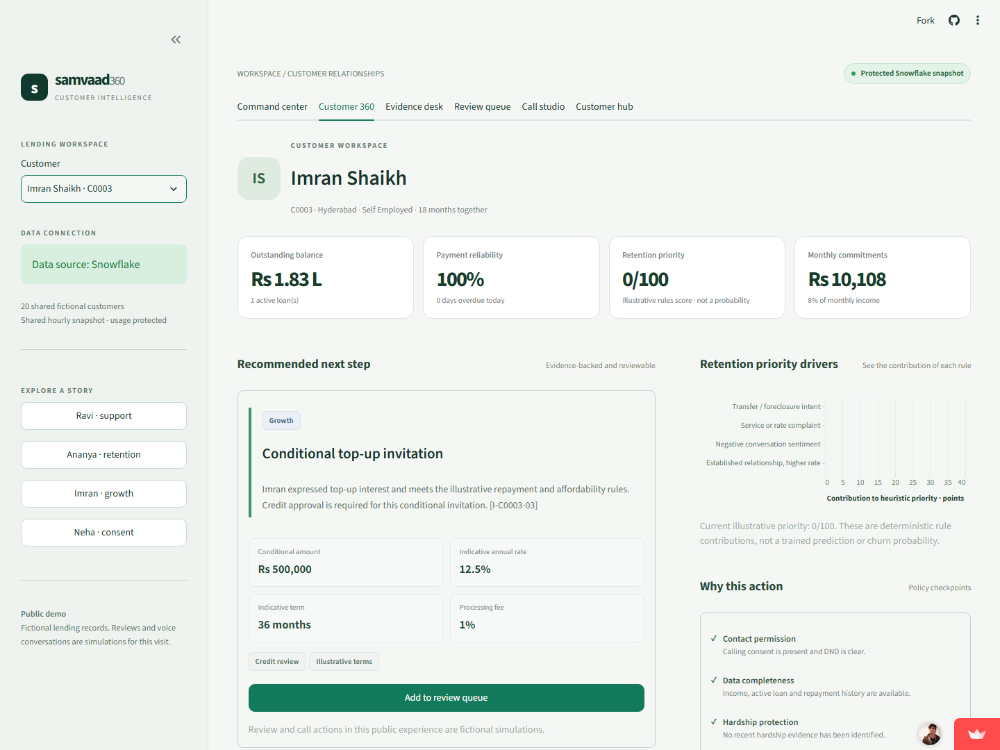

# Samvaad 360

**A lender Customer 360 that revises its next action when the customer's situation changes.**

Samvaad 360 connects loan and repayment records with emails, chats and call transcripts. Officers can inspect cited evidence, understand a recommendation, review a proposal and see how hardship or opt-out changes the permitted conversation.

Built for **Customer 360 and Next Best Action Engine** in the [Snowflake CoCo CLI Hackathon — GCC Edition](https://hack2skill.com/event/cococlihack-gccedition/).

**[Open the live prototype](https://samvaad360.streamlit.app/)** · **[Public repository](https://github.com/Cherie05/samvaad360)** · **[Official submission PDF](submission/Samvaad360_Official_Submission.pdf)** · **[Editable official deck](submission/Samvaad360_Official_Submission.pptx)**

**[Watch the 4:12 product walkthrough](https://github.com/Cherie05/samvaad360/releases/download/hackathon-submission-2026/Samvaad360_Demo.mp4)**. Recorded on the actual public Snowflake-backed website with narration at 1.4× playback. The required native CoCo CLI segment remains unverified; this recording covers the product workflow.



## Try the workflow

No login is required for the public fictional demonstration.

1. Open **Customer 360**, select **Kabir Bose**, inspect the repayment/conversation timeline, then compare **A job loss** in the what-if studio. The gentle reminder changes to supportive hardship contact with the evidence visible.
2. Select **Imran Shaikh**, add his proposal to **Review queue**, save a simulation review and open **Call studio**. Complete the permission/account-holder gates, then choose **I lost my job**. His earlier growth proposal stops.
3. Open **Customer hub** to rehearse fictional onboarding, reviewed source links, imports, service requests and contact withdrawal. Newly added profiles appear in Customer 360 within that visit.

If the free host is asleep, wake the app. Check its displayed data source: an unavailable trial uses a clearly labelled fictional backup.

## What is implemented

| Experience | Implemented capability |
| --- | --- |
| Six public workspaces | Portfolio charts, customer journey, cited answers, policy comparisons, review gates, adaptive conversations and Customer hub. |
| Private relationship portal | Persistent local intake/review, applicant forms, source identity links, versioned CSV/JSON imports, cases and preference withdrawals. |
| Cost controls | Shared hourly Snowflake snapshots, host-local query reservations and visitor admission; ordinary workflows use memory. |
| Decision evidence | Rule contributions, record citations and downloadable customer-scoped evidence. |

The public backend reads **20 seeded fictional customers from Snowflake**. Public changes are **visit-only**. The separate staff/API workflow persists in **SQLite**. Its private Snowflake synchronization worker is implemented but unconfigured; no automatic lender CRM connection is claimed.

## Verification

| Gate | Observed result |
| --- | --- |
| [GitHub tests and private app deployment](https://github.com/Cherie05/samvaad360/actions/runs/37490270245) | **557 tests passed**; deployment verified 20 customers and live files. |
| Hosted public browser | **20 checks passed**, including onboarding/import, requests/opt-out, visitor isolation and mobile layout. |
| Private local relationship browser | **6 end-to-end checks passed** over persistent staff/API/customer forms. |

Verified **6 October 2026**. See [build evidence](BUILD_STATUS.md) and [deployment details](docs/public-website-deployment.md).

Real telephone calling is disabled. The genuine carrier adapter awaits configuration and acceptance testing. The prototype is not production ready: enterprise identity, operational cloud storage and actual source integration remain required. Local CoCo installation and discovery of the evidence/generate/runner skills are verified; **actual CoCo workflow execution and its recording remain pending**. The six-page official deck follows the supplied organizer template, with **Glacier Queries / Arunvpp / team size 1**. No participant submission receipt is recorded.

## Run locally

Python 3.11, Windows PowerShell:

```powershell
python -m venv .venv
.\.venv\Scripts\python.exe -m pip install -r requirements.txt
.\scripts\run_local.ps1
```

Staff UI: **http://127.0.0.1:8501** · API: **http://127.0.0.1:8000/docs**. Local personas are demonstration identities. Voice/cloud dependencies are optional; setup and verification are in the [developer guide](docs/developer-guide.md).

**[Submission fields and remaining artifacts](docs/submission-guide.md)** · **[Demo script](docs/demo-script.md)** · **[Relationship architecture](docs/customer-relationship-plan.md)** · **[Production gates](docs/production-readiness.md)**
