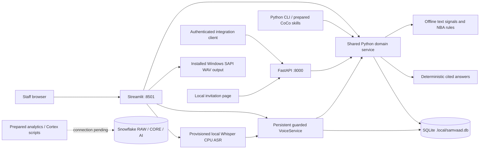

# Current architecture

Updated 5 October 2026, IST. Samvaad 360 is a local internal browser application for support analysts, retention managers, and credit officers. It combines fictional lending records and conversations with approved-action workflows. Customers encounter only a scoped synthetic invitation page; the borrower role in the Voice lab is a local demonstration.

## Frontend and application boundary

`app/streamlit_app.py` and `app/voice_ui.py` provide five tabs:

| Tab | Working local behavior |
| --- | --- |
| Customer 360 | Customer search, loan/payment facts, interactions, offline signals, decision evidence, and new transcript ingestion |
| Approvals & execution | Required-role approval or rejection and approved simulated execution |
| Ask Samvaad | Supported customer/portfolio questions, source citations, scope-aware chat history |
| Action history | Stored actions, outcomes, local offers, and audit events |
| Voice lab | Approved-session selection, bounded borrower/lender dialogue, local generated audio, microphone/WAV transcription, and persisted outcomes |

Streamlit runs server-side Python and calls the shared domain service directly. FastAPI exposes authenticated operator endpoints, interaction ingestion, and public token-scoped offer pages. An atomic offer-response method validates expiry, consent, action scope, and event identity inside one transaction. Exact opt-out replay succeeds without adding audit events; expired links always fail, including replays.

The staff selector simulates known identities on one developer machine. REST tokens map to fixed local identities and never trust a caller-supplied role. These controls support the local demonstration; production login and row access controls are unimplemented.

## Domain and decision services

`samvaad/service.py` owns transactions, approvals, consent, execution claims, offers, response deduplication, and audit records. The frontend, API, CLI, and voice controller share its checks. `factory.py` currently implements only the local adapter and raises `CLOUD_PENDING` for a requested Snowflake backend.

`signals.py` extracts six lending intents, bounded sentiment, simple entities, source hashes, and supporting borrower text. It handles basic negation and speaker labels. `engine.py` calculates metrics from active loans and dated evidence. Catalogue rows determine priority, approval role, and limits. Hardship takes precedence over retention/growth; default fictional limits are a 100 bps retention reduction and an INR 500,000 conditional top-up. Simulated execution never changes verified loan terms or payment records.

`knowledge.py` answers supported customer, policy, portfolio, and audit questions with actual source IDs. Today/week audit windows use IST; the local three-month payment window is 90 days. This provider is deterministic and offline. Live Cortex extraction, Search, Analyst, Agents, and unrestricted natural-language SQL are not application providers yet.

## Local voice implementation

`samvaad/voice.py` persists a bounded conversation for an already approved action. A fixed automation actor starts and advances the session. Starting rechecks consent, eligibility, catalogue/offer freshness, retries, and the three-attempt cap; an enforced partial unique index permits one active session per action. Turns and event IDs are persisted and deduplicated.

The dialogue moves through permission, demo account-holder confirmation, active discussion, and closure. Verbal confirmation is a synthetic gate, not production identity verification. The controller discusses stored approved terms only; it cannot negotiate or authorize a larger offer. Opt-out stops contact and persists consent changes. Borrower hardship suppresses a financial invitation and requests an officer review. After permitted, identity-confirmed sessions, speaker-labelled synthetic transcripts refresh Customer 360 while lender speech remains excluded from borrower signal extraction.

`samvaad/voice_audio.py` uses an installed Windows SAPI engine for actual WAV output. It passes speech text through private JSON rather than interpolating it into shell code. Speech recognition uses a provisioned, pinned Whisper-base conversion through faster-whisper/CTranslate2 on CPU INT8, with `local_files_only=True`; runtime never downloads a model implicitly. The local synthetic speech smoke and its limitations are recorded in [the voice check](../output/local-voice-check.json).

Production English TTS is provisionally planned around a stock Parler Mini v1 voice with its T5 tokenizer. Its exact model, tokenizer, encoder, codec, runtime, notices, and quality/latency benchmark remain release gates. Mini v1.1 stays disabled pending tokenizer provenance/terms. No neural production voice, cloned speaker asset, PBX, SIP trunk, or actual telephone call is active. See [telecalling plan](telecalling-plan.md) and [voice asset review](voice-license-review.md).

## Local storage

SQLite uses WAL, enforced foreign keys/unique IDs, bounded busy waits, and `BEGIN IMMEDIATE` writes. Each request opens its own connection. This supports the local transactional tests; it does not establish production throughput.

| Tables | Stored state |
| --- | --- |
| customers, loans, payments | Fictional profile/consent and lending facts, including active/closed loans |
| interactions | Source text, channel, timestamp, extracted signals, hashes, and simulation labels |
| catalogue, actions | Versioned policy, bounded proposal/evidence snapshot, approver, attempts, and action status |
| offers, response_events | Opaque scoped tokens, terms, expiry, and enforced response-event identities |
| audit_log | Approvals, blocked operations, execution, response, consent, and voice events |
| voice_sessions, voice_turns, voice_events | Action-linked session lifecycle, ordered speaker turns, and replay identities |

## Prepared cloud layer and remaining boundaries

`cloud/` and `scripts/cloud_*` prepare RAW/CORE/AI schemas, a Customer 360 view, reproducible fixture export/import, bounded Cortex enrichment, optional Search, and capability checks. The Python connector is installed. The [capability report](../output/cloud/capabilities.json) shows no configured account connection, selected warehouse, cloud metadata check, or discoverable CoCo executable. No cloud deployment or live inference has run.

For a standard trial, use PostgreSQL operational state for approvals, execution claims, response/voice events, offers, consent, and durable delivery workers, with Snowflake analytical data and Cortex providers. Standard Snowflake keys do not enforce the workflow uniqueness guarantees; hybrid tables are unavailable in trial accounts. A paid-account hybrid design requires a separate capability/transaction review. Neither operational cloud adapter is implemented. [Constraint overview](https://docs.snowflake.com/en/sql-reference/constraints-overview), [hybrid limitations](https://docs.snowflake.com/en/user-guide/tables-hybrid-limitations).

CoCo skills and the advisory hook are prepared and tested as Python code; actual skill discovery, account eligibility, and hook invocation are unverified. Production identity, an authoritative cloud workflow adapter, real Cortex providers, HTTPS hosting, PBX/media workers, carrier access, and live delivery remain separate release gates. The architecture does not equate a local voice session or an offer link with a real call, loan, rate change, or message.
