# Customer relationship portal: intake, servicing and data synchronization

Updated **6 October 2026, IST**. This document is the implementation and rollout plan for the Customer hub extension. The public prototype is [Samvaad 360](https://samvaad360.streamlit.app/). Actual onboarding and servicing belong to the private staff API and its operational database. Public anonymous exercises are isolated to the visitor's session.

## Verified release evidence

[GitHub run 37483107870](https://github.com/Cherie05/samvaad360/actions/runs/37483107870) passed **557 tests in 81.51 seconds** for source `7a619e718508777ee491bcf78309b0b2a8f0d7c3`. Deployment job `112337447935` succeeded, confirming 20 customers and `LIVE_VERSION_READY`. Local validation passed **555 tests in 78.18 seconds** in the full suite, followed by a **14-test targeted pass** including two additional engine fact cases. CI covers the complete 557-test suite.

The hosted public browser passed **20 checks** at **2026-10-06T15:00:27.839489Z**, and the local public browser passed **20** at **2026-10-06T14:59:04.862553Z**. Both observed a genuine Snowflake snapshot of 20 fictional customers and six public workspaces, including Customer hub. The private local relationship browser passed **six end-to-end checks** at **2026-10-06T14:51:38.877300Z**. Public checks cover six-workspace onboarding/import/request/opt-out, cross-visit isolation and mobile Customer hub alongside the existing evidence/policy workflows. Private browser checks exercised actual staff/API/customer-form persistence locally.

The shared public snapshot remains the seeded fictional cohort; new public relationships/imports/requests are visit-only. The private local staff/API path persists operational records in SQLite. The private relationship Snowflake schema/writer is not configured or applied, no real telephone call was performed, and production remains **NO-GO**. Community Cloud does not directly expose its deployed source commit. The local staff app and API are running at http://127.0.0.1:8501 and http://127.0.0.1:8000/docs.

## Where the existing customers come from

The current 20 customers are generated fictional fixtures, loaded into the Snowflake demonstration dataset and published as the four fixed tables in `SAMVAAD_STAGING.PUBLIC_DEMO`. A restricted website reader periodically retrieves a shared snapshot. That is a genuine Snowflake connection, but it is **not an automatic connection to a lender's CRM, loan-management system, email inbox or call-center platform**. Opening a profile does not fetch or modify an external account.

The operational local SQLite database is a separate system. A saved private customer, approved review, service case or phone callback does not previously appear in the public fictional portfolio merely because it was saved. This extension adds a real operational intake and synchronization path, plus a separate private analytical outbox. It does not promote customer contacts or transcripts into the anonymous public dataset.

| Data path | Owner | Current behavior |
| --- | --- | --- |
| Public fictional portfolio | Dedicated Snowflake website-reader role | Read-only shared snapshot; existing protections remain in effect. |
| Public Customer hub exercise | The current visitor's browser session | Synthetic onboarding/import/case rehearsal; no shared customer registration or Snowflake write. |
| Private Relationship hub and staff API | Authenticated pilot operators and SQLite service | Customer intake, review, cases, source links, versioned imports, consent changes and audit are persisted transactionally. |
| Customer service link | A short-lived, customer-scoped capability | A limited web form for requests and reduced contact preferences; it does not disclose account balances or prove borrower identity. |
| Private Snowflake relationship projection | Separate `SAMVAAD_RELATIONSHIP_SYNC` role | Optional bounded outbox worker, explicitly enabled through its CLI; credentials and schema activation are separate setup steps. |

## The complete relationship journey

```mermaid
flowchart LR
  A[Customer intake] --> B[Staff identity and document review]
  B --> C[Approve prospect profile]
  C --> D[Record permission and relationship owner]
  D --> E[Link lender source customer ID]
  E --> F[Preview loan/payment/interaction import]
  F --> G[Validate versions and references]
  G --> H[Commit operational records]
  H --> I[Refresh Customer 360 and policy evidence]
  I --> J[Reviewed next best action]
  J --> K[Permitted calling or service case]
  K --> L[Customer request or consent reduction]
  L --> I
  H --> M[Transactional private outbox]
  L --> M
  M --> N[Private Snowflake analytics]
```



1. **Collect an intake.** Capture name, contact details, preferred language and customer-provided profile fields. A staff analyst/admin can submit intake, or issue a 24-hour applicant invitation so the prospect fills their own `/portal/{token}` form. That applicant capability permits one application and cannot submit staff review flags. Permission switches default off. Record the permission reference before enabling contact preferences. Save a stable request key so a repeated submission returns the same intake.
2. **Review the prospect.** Analyst intake and manager/admin review are separate operations. The reviewer records identity/document attestations through the separate checklist endpoint before deciding a pending application. Approval requires those flags and a note. These flags are review records, not automated external KYC. Approval creates a prospect customer, without manufacturing a loan, payment, approved offer or telephone permission.
3. **Connect the correct lender identity.** A manager/admin explicitly links the external source customer ID to the approved local customer. The link is audited and cannot silently move to another customer. Imported customers can alternatively be created with deterministic source IDs; duplicate-contact validation requires resolving an ambiguous identity before commit.
4. **Preview the authoritative data.** Accept bounded CSV/JSON rows through the staff portal/API. Show inserts, updates, unchanged rows and precise validation errors. Customer, loan, payment and interaction references must belong to the source and resolve to the expected customer. Neither the preview nor a new browser session grants approval.
5. **Commit a validated batch.** Recheck source versions and relationships in the same SQLite write transaction. An unchanged record is a no-op. Older versions and the same version with changed content are rejected. Roll back the entire batch on an invalid reference. Save lineage, the committed source version and an audit event.
6. **Reassess the customer.** Read current records through the existing Customer 360 engine. Material source updates invalidate pending/approved actions and outstanding offers that depend on earlier evidence. A hardship/complaint case records its actual submitted text as a dated interaction, with its selected category attributed separately. It invalidates earlier proposals and requires review of a new eligible action; it cannot execute a loan change by itself. Resolving a case does not delete its historical conversation evidence or establish financial recovery.
7. **Service the relationship.** Assign an officer, case category, priority, due time and status. Track open, in-progress, waiting-customer, resolved and closed requests. A complaint or hardship follows a service path rather than silently becoming a marketing permission.
8. **Give the customer a limited service form.** Staff issue an expiring opaque invitation. Its token is stored as a digest. The web form permits scoped requests and reductions of contact preferences; opt-out revokes contact eligibility even after the case-request quota is exhausted. Repeated unchanged withdrawals create no new outbox event. Re-enabling contact requires a separately verified permission workflow.
9. **Export private analytical projections.** The transaction that changes a customer also saves a versioned outbox event. A separately configured worker writes that customer snapshot into the private relationship schema. A failed/uncertain delivery remains retryable; it does not block local servicing or expose the payload publicly.

## Record ownership and synchronization rules

| Record or field | Authoritative owner | Import behavior |
| --- | --- | --- |
| Prospect intake and document-review note | Customer intake plus reviewing staff | A pending intake cannot directly create a loan or pass an external identity check. |
| Internal customer ID and external source link | Operational relationship service; link approved by manager/admin | Source IDs are namespaced; a committed source record cannot be reassigned to a different customer. |
| Name, city, segment, income, language, phone and email | The explicitly selected source record or reviewed intake | Full-record updates require a higher source version. Ambiguous duplicates are blocked for review. An unverified income field is not independently verified underwriting evidence. |
| Loan principal, outstanding, EMI, rate, days past due and status | Configured lender loan-management source | Bound numeric/date/status validation; required source customer reference. Current importer supports lending records. |
| Due/paid dates, due/paid amount and payment status | Configured lender repayment source | Required source loan reference, version check and settled-payment consistency validation. It records supplied facts; it does not collect or debit a payment. |
| Interaction body, channel and timestamp | Supplied CRM/call-center/inbox export | Validate dated source text, retain source lineage and use the existing deterministic extraction. The CSV adapter is not an automatic Gmail/telephony connector. |
| Call/marketing permission and DND | Explicitly reviewed permission and customer preference workflow | Imports cannot silently expand permission; opt-out/DND reduction wins. Customer links cannot reactivate contact. |
| Action, frozen terms and approval | Existing governed action service | Updated source evidence cancels stale approvals/offers; a new action needs its own review. |
| Service case, due time and officer | Private relationship service | Persistent, bounded requests and audited status changes. |
| Private analytical projection | Operational outbox | Increasing customer version plus content hash; Snowflake remains a read model. |

Source integrations are pull/push **adapters**, not permission to overwrite every customer field. The implemented first adapter is manual bounded JSON/CSV preview and commit, authorized for analyst/admin pilot operators. The pilot accepts operator-supplied source labels and versions; these are not externally authenticated LMS assertions or an enforced enterprise field-ownership registry. The ownership table describes the selected deployment mappings. A real LMS integration needs its actual endpoint/export specification, private credentials, credential-to-source authorization, field-owner checks and tested mappings. A scheduler, webhook or CDC service can then invoke the same preview/commit contract with a narrowly scoped integration identity. No periodic LMS, insurance-policy, claims or mailbox connector is claimed to be configured.

Current lending rows use `record_type`, `source_record_id` and positive `source_version`. Loans/interactions reference `customer_ref`; payments reference `loan_ref`. Sources must be distinct names such as `lms_pilot`, not a collection of anonymous uploads. The current importer handles full records and does not support source tombstones. A closed loan uses a higher-version `status=CLOSED`, with zero outstanding. Deletion/retention and cross-source identity merging require a reviewed extension rather than an invented financial reversal.

## Frontend, API and storage

| Component | Implementation | Storage or trust boundary |
| --- | --- | --- |
| Public Customer hub | Sixth Streamlit public workspace | Visit-only synthetic state; it demonstrates onboarding, sync and servicing without becoming a shared anonymous CRM. |
| Private Relationship hub | Sixth local staff workspace | Calls the same `RelationshipService` as the API; local personas are pilot identities. |
| Staff API | FastAPI routes under `/api/relationship/...` | Existing private staff bearer resolver; no role/name supplied in a request grants authorization. |
| Customer form | FastAPI HTML under `/portal/{token}` | Customer-scoped, expiring capability; sensitive account information is excluded. |
| Operational records | SQLite transactions, enforced keys and idempotency requests | Development/pilot single-store implementation. PostgreSQL plus tenant authorization is the production target. |
| Analytics sink | Snowflake `SAMVAAD_STAGING.RELATIONSHIP.CUSTOMER_PROJECTIONS` | Private `VARIANT` projection; contacts and transcripts may be sensitive. Public reader receives no grant. |

The persistent service is [samvaad/relationship.py](../samvaad/relationship.py). Its relationship tables cover intake reviews, separately retained checklist/mapping review notes, profiles, cases, source mappings/versions, import runs, request idempotency, portal invitation digests and leased outbox events. The existing customer/loan/payment/interaction/action tables continue to own their domain records.

The staff API exposes these concrete routes. Creation/preview requests use the `Idempotency-Key` header; customer-form request keys are generated in their HTML forms. Staff routes require the configured bearer-to-operator resolver and each domain method checks its permitted role again.

| Method and route | Purpose and permitted pilot role |
| --- | --- |
| `GET /api/relationship/status` | Operational counts for staff. |
| `GET/POST /api/relationship/onboardings` | Staff list; analyst/admin intake submission. |
| `POST /api/relationship/onboarding-invitations` | Analyst/admin create an applicant's one-application capability. |
| `POST /api/relationship/onboardings/{id}/attest` | Manager/admin record identity/document checklist and note without approving. |
| `POST /api/relationship/onboardings/{id}/review` | Manager/admin approve/reject a pending application with a note. |
| `GET /api/relationship/customers/{id}` | Staff customer context, relationship, cases and source lineage. |
| `POST /api/relationship/customers/{id}/cases` | Staff open a case with assigned owner, category, priority and optional due time. |
| `POST /api/relationship/cases/{id}/decision` | Staff status/note update; resolve before closing, with closed cases immutable. |
| `POST /api/relationship/customers/{id}/portal-invitations` | Staff issue a 24-hour scoped customer capability; a new invitation revokes the old one. |
| `POST /api/relationship/sync/customer-links` | Manager/admin bind the source customer identity with a review note. |
| `POST /api/relationship/sync/preview` | Analyst/admin validate 1–200 supplied source records. |
| `GET /api/relationship/sync/runs` and `GET /api/relationship/sync/runs/{id}` | Staff import summaries/errors, excluding stored raw records. |
| `POST /api/relationship/sync/runs/{id}/commit` | Analyst/admin atomically revalidate and commit a valid preview. |
| `GET /api/relationship/outbox` | Staff/automation queue counts and event metadata, excluding payloads and lease tokens. |
| `GET /portal/{token}` and `POST /portal/{token}/submit` | Capability-only applicant/customer HTML form, limited to its purpose and subject. |

Source-link approval belongs to the private staff path. Transport adapters must preserve the authorization boundary rather than invoking a worker using a public visitor identity. API tokens and OIDC settings stay in private server configuration; they are not a repository file or a CSV column. The private API/customer form is implemented and tested locally; it is not hosted merely because the anonymous Streamlit frontend is live. External use needs the separately deployed HTTPS API origin.

## Enabling the private Snowflake sink

The sink is implemented in [cloud/relationship_sync.py](../cloud/relationship_sync.py); the manual entry point is [scripts/relationship_sync.py](../scripts/relationship_sync.py). It does **not** reuse the public website reader or write `PUBLIC_DEMO`.

1. Review the one-time [private schema SQL](../cloud/sql/008_relationship_sync.sql). An account/schema owner creates the schema, table and dedicated role. The SQL does not create a warehouse, service user, scheduled task or customer data. Grant the role separately to an approved private key-pair service user. The existing `SAMVAAD_XS` warehouse remains separately governed by its credit monitor.
2. Configure a named Snowflake connection outside the repository. Its role must be `SAMVAAD_RELATIONSHIP_SYNC`, default database `SAMVAAD_STAGING`, and warehouse the existing approved warehouse. Keep the private key and passphrase in the supported private credential configuration. Do not paste them into the customer portal or chat.
3. Point the non-secret cloud configuration at that named connection and database. Confirm the operational database already exists. Sync never seeds or manufactures its source database.
4. Run the default inspection command. It prints queue counts and the target, without connecting or exposing payloads:

   ```powershell
   .venv\Scripts\python.exe -m scripts.relationship_sync --db .local/samvaad.db
   ```

5. Run one explicitly requested batch after credentials and role grants are ready:

   ```powershell
   .venv\Scripts\python.exe -m scripts.relationship_sync --db .local/samvaad.db --apply --max-events 5
   ```

Each run verifies the actual role, database and warehouse before claiming source events. It claims at most five snapshots, with 900-second leases, a 300-second statement-dispatch deadline and a 15-second timeout for each SQL statement. The deadline prevents starting additional statements; it is not a hard process kill. It issues at most **26 application statement attempts**, including identity, explicit per-event transaction, parameterized `MERGE`, read-after-write verification, commit and possible rollback. Snapshots above 1 MiB are rejected rather than truncated; production history growth needs a paginated/partitioned projection adapter. This is a separate private worker budget, not the public reader's hourly/day reservation or a guaranteed billed-credit limit.

A newer snapshot replaces an older one. The same version/hash can be safely retried; a same-version hash conflict is rejected. A known later stored version supersedes an old retry without downgrading the projection. The local event is marked sent only after the private projection is verified and committed while its lease is active. A crash before acknowledgement leaves a retryable event after lease expiry.

The CLI takes a **host-local single-writer lock**. Run one scheduled worker for this sink across the deployment; independent hosts are not coordinated by that file. The sink detects duplicate target customer rows and rolls back that event. Standard Snowflake table primary/unique keys are not enforcement mechanisms, so parallel uncoordinated initial inserts cannot be presented as a global atomic upsert guarantee. [Snowflake constraint overview](https://docs.snowflake.com/en/sql-reference/constraints-overview), [MERGE behavior](https://docs.snowflake.com/en/sql-reference/sql/merge), [transaction semantics](https://docs.snowflake.com/en/sql-reference/transactions).

No private relationship schema execution or cloud projection delivery is implied by local tests. Activation requires the private configuration and an actual reconciliation run. Scheduling this worker continuously is a later operational setup task; neither GitHub CI nor an anonymous page view automatically syncs real customers.

## A complete acceptance workflow

Use fictional contacts in local/hackathon checks. The public rehearsal permits only synthetic input. For private setup, never load real borrower data until authentication, encryption, retention and authorized integration mapping are established.

1. Submit a new prospect twice with the same request key. Confirm one intake and no loan.
2. Attempt approval without identity/document attestations; confirm rejection. Add the review evidence and approve once; confirm the assigned customer survives a fresh service instance.
3. Approve a source customer-ID link for that same local customer. Preview a loan, a payment and a dated conversation using the linked source ID. Show the reference/version checks before committing.
4. Commit, refresh Customer 360 and reconcile loan/payment totals and interaction evidence. Repeat the same version unchanged; confirm no duplicate records. Send an older version and a different payload under the same version; confirm rejection and no partial writes.
5. Add a hardship/service case, assign an owner and due time, then resolve it with a note. Show the persistent queue and relationship history. For hardship, confirm its actual text is evidence and the earlier growth approval is cancelled; resolving the case must not erase that history. A hardship message submitted under complaint must retain its extracted hardship signal.
6. Issue a scoped customer link. Submit a service request and opt out through the form. Confirm other customers are excluded, no balances/raw contacts are disclosed, and stale calling permissions/offers are revoked. Replay the request key; confirm it is not duplicated. Exhaust the case quota and verify an actual withdrawal remains possible; repeating an unchanged withdrawal must not enqueue more snapshots.
7. Inspect the outbox: increasing versions, source customer linkage and metadata only. In a separately authorized cloud acceptance run, apply a bounded batch, verify its version/hash and check a retry/expired lease path. Confirm no customer appeared in `PUBLIC_DEMO`.

Automated tests accompany the service, API and private worker. They demonstrate the implemented local contracts; they do not establish an external KYC result, borrower authentication, actual LMS delivery, a live customer call or multi-tenant production readiness.

## Production rollout gates

The delivered extension is a working local/pilot relationship flow and an isolated public demonstration. Production still requires these concrete changes:

| Gate | Required evidence |
| --- | --- |
| Staff identity and scope | Enterprise IdP login, tenant/customer access enforcement, integration/automation principals, denied cross-tenant tests and managed secret rotation. Local staff persona selection is insufficient. |
| Borrower identity | Verified onboarding/KYC provider as required by the deployment; staff checkboxes remain attestations. Strong customer login/OTP and recovery before financial disclosure or consent reactivation. |
| Durable operational storage | PostgreSQL migration preserving transactions, keys, idempotency, leases and revocation; backups, restore proof and tested job recovery. |
| Source integration | A configured lender source with mapped field ownership, stable IDs/versions, reconciliation totals, deletion/retention handling and observed sync latency. CSV upload alone does not establish continuous synchronization. |
| Private analytics | Separate least-privilege credentials, one writer or properly coordinated jobs, verified role grants, reconciliation and access/retention controls. No automatic real-data publication. |
| Telephone execution | Existing carrier pilot safeguards plus configured verified destinations, actual HTTPS callbacks and a measured permitted call. See [real telephone pilot](real-telephony-pilot.md). |
| Operational support | Case SLAs, staffed escalation, customer-link delivery, outage alerts, service audit, API rate limits and measured recovery/load behavior. Sending a notification remains separate from generating its link. |

Insurance policies, claims, document binary upload/storage, e-sign, payment collection, bulk campaigns, production email/SMS notification delivery and an automatic external KYC/CRM connector are not implemented by this lending relationship extension. They can use the same review/source/outbox boundaries when added with their own schemas and acceptance checks.
