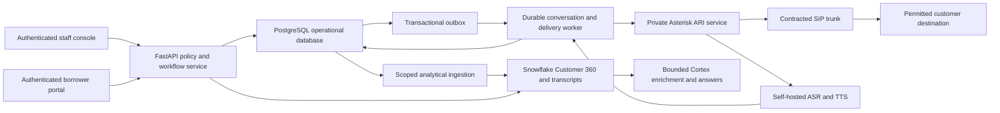

# Samvaad 360 product and production plan

Prepared **6 October 2026, IST**. The live prototype is [samvaad360.streamlit.app](https://samvaad360.streamlit.app/); its source is [Cherie05/samvaad360](https://github.com/Cherie05/samvaad360). This plan describes the product direction and release checks. A planned feature becomes an implemented feature only after its code, tests and hosted workflow are verified in [build status](../BUILD_STATUS.md).

## Product focus

Build a lender officer's workbench that answers three practical questions: **Who needs attention, what should we do, and what changed after the conversation?** Combine loan and repayment facts with borrower emails, chats and call transcripts. Give each recommendation a reason, source evidence, required reviewer and contact policy.

The distinctive demonstration is a complete loop:

**Customer evidence → policy decision → reviewed conversation → new borrower evidence → revised action.**

An attractive dashboard makes that loop understandable. The underlying evidence and policy adaptation make it useful. There is no guarantee of winning. The official rubric assigns **40% to technical execution, 30% to real-world relevance and 30% to solution completeness**. The chosen challenge asks for structured and unstructured customer touchpoints, including call transcripts, and a next-best-action recommendation. [Official hackathon page](https://hack2skill.com/event/cococlihack-gccedition/)

The owner's participant portal lists **6 October 2026, 11:59 PM IST** as its submission deadline. The public event page still lists an earlier prototype window; this document does not claim the extension was independently verified. Prioritise a working, accurately described lender journey and the required submission artifacts. Insurance claims and validated underwriting models are later domain releases.

## How the existing application works

| Component | Implemented baseline | Boundary |
| --- | --- | --- |
| Public frontend and backend | Streamlit/Python in `public_app/streamlit_app.py`, hosted on Community Cloud | The Python process renders the UI and runs the domain service; a separate REST server is not required for this prototype. |
| Public database connection | Dedicated Snowflake service-key reader; four fictional snapshot tables in `SAMVAAD_STAGING.PUBLIC_DEMO` | Fixed bound read queries; 20 fictional customers. The public identity cannot save staff approvals or change financial terms. |
| Public review state | Browser-visit Streamlit session state | A simulated review belongs to that visit. It is not a durable staff decision or a Snowflake ledger write. |
| Evidence and recommendations | Shared Python rules and evidence summaries in `samvaad/` | Illustrative policy scores and affordability checks, rather than validated churn probabilities or real credit decisions. Public answers do not invoke Cortex. |
| Private operator demonstration | Separate Streamlit app inside Snowflake; Snowpark-backed reads and demo review records | Owner-authenticated demo reviews persist in Snowflake. This is separate from public session state and from the full production operational service. |
| Local staff application and API | Streamlit staff UI, FastAPI integration endpoints and transactional SQLite demo state | Development identities and synthetic data; the full operational cloud repository remains pending. |
| Local voice lab | Bounded persisted conversations, installed Windows speech synthesis and pinned local Whisper recognition | Tested local speech is not a carrier call, production identity verification or a portable production voice deployment. |

If Snowflake is unavailable, the public app can use its checked fictional bundle and displays the actual source. Backup results must not be presented as live Snowflake or Cortex responses. Free website hosting does not make database queries or future phone calls free. Trial expiry can suspend Snowflake even when a balance remains. [Snowflake trial conditions](https://docs.snowflake.com/en/user-guide/admin-trial-account)

## Improved prototype experience

The redesign should expose the workflow in a clear order:

1. **Officer dashboard:** readable portfolio counts, a prioritised case queue and guided examples for hardship, retention, top-up and contact suppression. Show what the counts measure; do not present estimated revenue as recovered revenue.
2. **Customer workspace:** customer summary, outstanding amount, payment history and a timeline of messages. Put the next action, reviewer and supporting evidence together. Use readable offer fields and status labels instead of raw JSON.
3. **Review simulation:** an explicit decision and note, with pending/completed states. Keep anonymous decisions isolated between visitors and clearly distinguish them from real staff approvals.
4. **Conversation studio:** start a fictional dialogue, show borrower/assistant turns, and demonstrate callback, refusal, hardship and opt-out. Show the input/output mode. A browser conversation or audio preview must not be labelled a telephone call.
5. **Decision adaptation:** display the new evidence, previous recommendation and resulting policy response together. Export a fictional transcript and outcome for the demo.

Use consistent navigation, visible primary actions, short empty-state instructions, legible contrast, keyboard-operable controls and a layout that works on mobile. Keep the data-source status visible. Explain limits beside decisions where they affect the visitor's choices.

The public conversation implementation must preserve the reader's permissions: new utterances and demonstration outcomes stay in the visitor's simulation. They must not update the shared fictional snapshots or another visitor's review. Hosted verification must show which redesign features actually shipped.

## A strong judge journey

**Kabir C0007: a recommendation that adapts.** Start with his overdue-payment facts and gentle reminder. Add the fictional borrower statement, "I lost my job and cannot pay my EMI. Please help." Show the new cited interaction and the policy switch to supportive hardship contact. His existing overdue status matters: the current hardship action requires both hardship evidence and DPD between 1 and 60. No payment break or changed loan terms are promised.

**Imran C0003: growth that stops when circumstances change.** Inspect his repayment history and top-up-interest evidence, then review the conditional invitation in the simulation. During the conversation introduce new repayment hardship. Stop the growth invitation and record an officer-review/callback outcome. His DPD is zero, so the existing engine must not invent a hardship-action recommendation whose overdue-payment condition is unmet. Show the actual resulting policy decision.

**Neha C0004: consent wins over opportunity.** Show the contact restriction and blocked action. In a permitted fictional conversation, demonstrate that an opt-out ends contact and prevents later simulated contact for that visit.

These cases establish traceable behaviour; they do not prove real-world churn reduction, revenue uplift or underwriting quality. Any conversation path described above must pass the release checks before appearing in the submitted demonstration.

The supplied portal additionally requires a **3–5 minute video**, one working CoCo CLI workflow with **Input → Processing → Output**, and **2–3 modular capabilities**, plus the organizer-template PDF under 5 MB. Prepared `.cortex/` skills are available, but actual account/skill/hook execution must be demonstrated. A successful Cortex SQL connection test is separate evidence. Show evidence inspection, recommendation generation and an explicitly approved simulated execution; never let the assistant approve its own financial proposal. [CoCo CLI documentation](https://docs.snowflake.com/en/user-guide/cortex-code/cortex-code-cli)

## Recommended production architecture

Keep the current Streamlit website as the live synthetic prototype. A React/Next.js TypeScript frontend is an optional later migration for a richer staff console and borrower portal; it is not needed to keep this prototype online.

| Layer | Production choice and responsibility |
| --- | --- |
| Frontend | Retain Streamlit for an initial authenticated staff pilot; optionally move to React/Next.js for the full console. Browsers call the application API and never hold database, model-provider or PBX credentials. |
| Application backend | FastAPI plus the shared Python policy/conversation modules. Enforce authenticated roles, customer scope, current consent, reviewed terms, expiry and replay checks on the server. |
| Operational database | PostgreSQL for tenants, staff assignments, consent versions, approvals, actions, outbox jobs, call events, callback requests and deliveries. Make review/action/outbox changes atomic. |
| Worker | Claim outbox jobs with leases and retries. Use a durable event ID to deduplicate repeated or reordered events. Reconcile an ambiguous dial request with the PBX before retrying. Redis may assist admission limits or caching; PostgreSQL remains the authoritative state. |
| Analytics and AI | Snowflake for governed customer facts, interactions, lineage and outcome analytics. Use scoped service identities/views and tenant/customer filters. Bound Cortex requests, timeouts and spend; treat retrieved text as evidence, not executable instructions. |
| Audio and recordings | Private object storage with access controls, authorized recording state, retention/deletion and audited retrieval. Store references in PostgreSQL; do not expose recordings through anonymous public links. |
| Voice and telephony | Separate self-hosted ASR/TTS processes, a private Asterisk process controlled through an adapter, and a contracted SIP trunk for external calls. Production voice assets and carrier delivery are still dependencies. |

Derive staff roles from trusted login: agent, manager, credit reviewer, tenant administrator and a distinct automation principal. An agent can propose; the designated reviewer can approve; the worker can execute only the approved frozen proposal. Enforce tenant and assigned-customer scope on every read, review, transcript and export. Borrower account access requires a separately approved authentication flow. A spoken "yes" is only a synthetic demo gate.

## Delivery phases and release checks

| Phase | Deliverable | Required release evidence |
| --- | --- | --- |
| 0 — Public prototype refresh | Officer workbench, readable journey/evidence, conversation demonstration and decision adaptation, deployed from reviewed GitHub source | Relevant automated checks pass; fresh anonymous desktop/mobile browser verifies the hosted features, actual data source, visitor isolation, DND and hardship/growth rules. Record the deployed commit. |
| 1 — Operational cloud staging | PostgreSQL repository, FastAPI contracts, versioned approvals/consent and transactional outbox | Concurrent approval/claim tests, stale-consent denial, replay/conflict handling, crash/retry recovery and data reconciliation against the existing synthetic domain behaviour. |
| 2 — Trusted staff pilot | Login, server-derived roles, tenant/customer scopes, secret management and audit access | Wrong-role and cross-customer/tenant tests fail safely; authenticated exports are scoped; secrets rotate; HTTPS, request limits, backup restoration and deletion are rehearsed. |
| 3 — Scoped analytics and AI | Ingested interactions/outcomes, grounded Cortex enrichment and evidence answers | Confirm source lineage, borrower/assistant speaker separation, customer isolation, answer-quality evaluation, bounded query/model use and visible stale/unavailable-data behaviour. |
| 4 — Self-hosted voice and SIP lab | Pinned speech assets, ASR/TTS worker, Asterisk adapter and private softphone conversation | Asset/license inventory and notices reviewed; measured speech quality and latency; test silence, noisy audio, financial numbers, interruption, opt-out, human handoff and PBX event reconciliation. No external dialing in this phase. |
| 5 — Controlled carrier pilot | Contracted trunk, allocated calling identity and approved test destinations | Lender/carrier approve purpose, recipients, calling policy, recording and borrower authentication. Verify actual answer/hangup/audio/transfer events and suppress duplicate origination. Use explicitly permitted test recipients. |
| 6 — Production operation | Defined capacity, on-call ownership, monitoring, restore/rollback and quality evaluation | Measured warm/cold load, worker lease recovery, retention/deletion, protected audit records, incident drills and pilot acceptance. Validate business policy/model use on permitted real data before broader rollout. |

No phase authorizes an assistant to negotiate unreviewed terms, disburse a loan or place arbitrary calls. Define acceptance targets with the lender and measure them; do not substitute library benchmarks for deployed capacity or voice quality.

## What real automated calling requires

The conversation controller should check consent and the approved action before dialing and again when circumstances change. Disclose the automated assistant, apply the approved recording policy, authenticate the borrower before revealing account details, confirm recognized amounts/dates and offer a person when uncertain. Persist opt-outs and cancel affected jobs; record a callback request without claiming a call was scheduled or a transfer completed before provider confirmation.

Asterisk ARI provides call/media control and asynchronous events. Place it behind the application server; it should not be directly accessed from a staff web page. The adapter must implement the media transport and event reconciliation for the selected deployed version. [Asterisk ARI architecture and production practices](https://docs.asterisk.org/Configuration/Interfaces/Asterisk-REST-Interface-ARI/)

Whisper-based self-hosted ASR and a stock neural TTS voice are candidate components. The existing voice review selects Parler Mini v1 provisionally; its exact model, tokenizer, codec, runtime and notices still need deployment review and measured English/financial-entity quality. Windows SAPI remains a local host feature. No custom voice recording is required for the proposed stock-voice route, and no blanket license clearance is claimed. See [voice asset review](voice-license-review.md).

Owning the software does not supply a carrier connection, calling number, recipient permission or recording rights. A licensed SIP-trunk arrangement and the lender/carrier's approved automated-calling process are necessary for real destinations. Hosting, inference hardware, storage, number rental and carrier minutes need an actual cost estimate. See the detailed [telecalling plan](telecalling-plan.md) for the existing state machine, media, asset and carrier gates.

## Current release boundary

The deployed website is a fictional lender prototype with genuine restricted Snowflake reads and visit-local simulations. The separate operator demonstration persists demo reviews in Snowflake; the local voice lab persists synthetic conversations in SQLite. These are three different state boundaries.

Production PostgreSQL workers, trusted multi-tenant identities, live carrier calling, production voice assets and validated credit/churn models remain planned until their release evidence exists. The redesign deployment and tests should update [build status](../BUILD_STATUS.md), [public deployment](public-website-deployment.md) and [submission fields](hackathon-submission.md) with their actual results.
