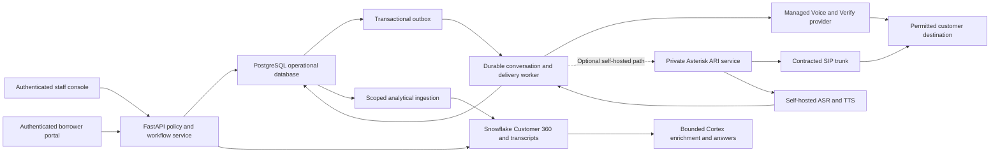

# Samvaad 360 product and production plan

Updated **6 October 2026, IST**. The prototype is live at [samvaad360.streamlit.app](https://samvaad360.streamlit.app/); its source is [Cherie05/samvaad360](https://github.com/Cherie05/samvaad360). [GitHub run 37483107870](https://github.com/Cherie05/samvaad360/actions/runs/37483107870) passed **557 tests in 81.51 seconds** for source `7a619e718508777ee491bcf78309b0b2a8f0d7c3`. Deployment job `112337447935` succeeded, confirming 20 customers and `LIVE_VERSION_READY`. Local validation passed **555 tests in 78.18 seconds** in the full suite, followed by a **14-test targeted pass** including two additional engine fact cases. CI covers the complete 557-test suite. The hosted public browser passed **20 checks** at **2026-10-06T15:00:27.839489Z**, and the local public browser passed **20** at **2026-10-06T14:59:04.862553Z**. Both observed a genuine Snowflake snapshot of 20 fictional customers and six public workspaces, including Customer hub. The private local relationship browser passed **six end-to-end checks** at **2026-10-06T14:51:38.877300Z**. Hosting does not directly expose its commit. See [build status](../BUILD_STATUS.md).

## Product focus

The verified relationship extension adds local persistent onboarding/review, customer forms, source identity links, versioned import and service cases, plus a separate private outbox/manual Snowflake sink. The public Customer hub rehearses these features per visit. Its private writer/schema remain unconfigured/unapplied, and no actual CRM/LMS auto-sync is claimed. See [the end-to-end relationship plan](customer-relationship-plan.md).

The implemented extension adds portfolio exposure and intervention charts, a repayment/conversation timeline, explicit retention-rule contributions, governance coverage, a four-context comparison and a downloadable decision evidence packet. Shared hourly Snowflake snapshots now enforce application-query budgets and visitor throttling. A genuine Twilio telephone transport and staff-only existing/additional-number controls are prepared but unconfigured. See [the enterprise implementation and release plan](enterprise-release-plan.md) for current protection scope, carrier activation and remaining production gates.

Build a lender officer's workbench that answers three practical questions: **Who needs attention, what should we do, and what changed after the conversation?** Combine loan and repayment facts with borrower emails, chats and call transcripts. Give each recommendation a reason, source evidence, required reviewer and contact policy.

The distinctive demonstration is a complete loop:

**Customer evidence → policy decision → reviewed conversation → new borrower evidence → revised action.**

An attractive dashboard makes that loop understandable. The underlying evidence and policy adaptation make it useful. There is no guarantee of winning. The official rubric assigns **40% to technical execution, 30% to real-world relevance and 30% to solution completeness**. The chosen challenge asks for structured and unstructured customer touchpoints, including call transcripts, and a next-best-action recommendation. [Official hackathon page](https://hack2skill.com/event/cococlihack-gccedition/)

The owner's participant portal lists **6 October 2026, 11:59 PM IST** as its submission deadline. The public event page still lists an earlier prototype window; the participant-specific extension is owner-supplied. Prioritise an accurately described lender journey and the required submission artifacts. Insurance claims and validated underwriting models are later domain releases.

## How the existing application works

| Component | Implemented baseline | Boundary |
| --- | --- | --- |
| Public frontend and backend | Streamlit/Python in `public_app/streamlit_app.py`, hosted on Community Cloud | The Python process renders the UI and runs the domain service; a separate REST server is not required for this prototype. |
| Public database connection | Dedicated Snowflake service-key reader; four fictional snapshot tables in `SAMVAAD_STAGING.PUBLIC_DEMO` | Shared refresh reserves five application statements: identity plus four reads. Host-local eight/hour and 64/day limits are statement reservations, not credit meters; host replacement can reset them. Visitor workflows then use memory. |
| Public admission | Global/shared anonymous browse and action limits | Community Cloud IP values are untrusted. Genuine peer-IP limits require the prepared managed gateway; that gateway is not deployed on the free host. |
| Public review state | Browser-visit Streamlit session state | A simulated review belongs to that visit. It is not a durable staff decision or a Snowflake ledger write. |
| Public Call studio | Bounded visit-local conversations with permission/fictional identity gates, borrower replies, outcome export and hardship/opt-out adaptation | A current approved simulation review is required. Browser speech controls are optional; actual audible playback was not established by the browser checks. No microphone capture, telephone call or database write is represented. |
| Scenario comparison | New context is evaluated on a copy of the customer view using the shared decision rules | Before/after results are reversible simulations. They do not overwrite the shared Snowflake customer or payment records. |
| Evidence and recommendations | Shared Python rules and evidence summaries in `samvaad/` | Illustrative policy scores and affordability checks, rather than validated churn probabilities or real credit decisions. Public answers do not invoke Cortex. |
| Private operator demonstration | Separate Streamlit app inside Snowflake; Snowpark-backed reads and demo review records | Owner-authenticated demo reviews persist in Snowflake. This is separate from public session state and from the full production operational service. |
| Local staff application and API | Streamlit staff UI, FastAPI integration endpoints and transactional SQLite demo state | Development identities and synthetic data; the full operational cloud repository remains pending. |
| Local voice lab | Bounded persisted conversations, installed Windows speech synthesis and pinned local Whisper recognition | Tested local speech is not a carrier call, production identity verification or a portable production voice deployment. |
| Genuine telephone pilot | Twilio Voice/Verify adapter, signed callbacks, staff OIDC bridge and existing/additional verified-number controls | Disabled and unconfigured. Uses a separate SQLite operational ledger; public simulation reviews cannot approve its actions. No real call or SMS was sent. |

If Snowflake is unavailable, the public app can use its checked fictional bundle and displays the actual source. Backup results must not be presented as live Snowflake or Cortex responses. Free website hosting does not make database queries or future phone calls free. Trial expiry can suspend Snowflake even when a balance remains. [Snowflake trial conditions](https://docs.snowflake.com/en/user-guide/admin-trial-account)

## Shipped prototype experience

Six workspaces now expose the workflow:

1. **Command center:** a prioritised case queue, overdue-exposure/action charts, observed signals, data-quality coverage and usage protection. Portfolio totals describe fictional records; illustrative interest differences are not recovered revenue.
2. **Customer 360:** repayment/conversation timeline, explicit retention-rule contributions, readable offers/policy checks and four-context comparison using the actual engine. The score is a heuristic priority, not a calibrated churn probability.
3. **Evidence desk:** scoped questions, source excerpts and downloadable customer decision evidence without contact details. Public answers do not trigger a Cortex request.
4. **Review queue:** pending/completed simulated reviews with a decision, note and export. Anonymous decisions remain isolated between visits and are distinct from real staff approvals.
5. **Call studio:** a fictional borrower/lender conversation with permission and account-holder confirmation, typed or suggested replies, optional click-to-play browser speech, opt-out and officer-handoff outcomes. New hardship stops an earlier growth invitation, exposes the added evidence and revised decision, and puts further contact on hold for that visit. A conversation record can be exported.

6. **Customer hub:** visit-only fictional intake/review, source ID links and bounded imports, customer requests/withdrawals and a data-sync explanation. New profiles appear across Customer360/evidence in that visit; shared Snowflake records remain unchanged. The separate private local Relationship hub persists real operational workflow state in SQLite. See [the customer relationship plan](customer-relationship-plan.md).

The redesigned forest/off-white interface uses readable cards, status labels, clear primary actions, empty-state guidance and a mobile layout. The current release passed hosted workflow and mobile checks. Browser voice controls and text fallback were inspected; audible playback, speech quality and assistive-technology coverage still require their own checks.

New utterances and demonstration outcomes stay in the visitor's simulation. The public reader cannot update the shared fictional snapshots or another visitor's review. A browser conversation and its optional speech preview are a rehearsal: no real telephone call, delivered invitation or financial change occurs.

## A strong judge journey

**Kabir C0007: a recommendation that adapts.** In Customer 360, start with his overdue-payment facts and gentle reminder. Choose the new-hardship scenario and compare the actions, or use the statement "I lost my job and cannot pay my EMI. Please help" in a reviewed Call studio rehearsal. Show the new fictional interaction and the policy switch to supportive hardship contact. His existing overdue status matters: the current hardship action requires both hardship evidence and DPD between 1 and 60. The comparison and call outcome remain visit-local; no payment break or changed loan terms are promised.

**Imran C0003: growth that stops when circumstances change.** Inspect his repayment history and top-up-interest evidence, then review the conditional invitation in the simulation. During the conversation introduce new repayment hardship. Stop the growth invitation and record an officer-review/callback outcome. His DPD is zero, so the existing engine must not invent a hardship-action recommendation whose overdue-payment condition is unmet. Show the actual resulting policy decision.

**Neha C0004: consent wins over opportunity.** Show the contact restriction and blocked action. In a permitted fictional conversation, demonstrate that an opt-out ends contact and prevents later simulated contact for that visit.

These implemented cases establish traceable synthetic behaviour; they do not prove real-world churn reduction, revenue uplift or underwriting quality. The hosted release verified that new hardship closes an earlier growth conversation and blocks its continuation. Real borrower authentication and live telephone delivery are separate production gates.

The supplied portal additionally requires a **3–5 minute video**, one working CoCo CLI workflow with **Input → Processing → Output**, and **2–3 modular capabilities**, plus the organizer-template PDF under 5 MB. Local CoCo 1.1.87 and discovery of all three `.cortex/` project skills are verified. The owner's actual interactive native evidence/generate/runner workflow and recorded idempotent replay are now verified against returned tools and stored COMPLETED/CALLBACK/simulate state. The final 3:42 recording combines native CoCo and public UI without audio. Project hooks are advisory; native sandbox enforcement is not claimed. The supplied organizer-template PDF is now published and visually checked. A successful Cortex SQL connection test is separate evidence. Show evidence inspection, recommendation generation and an explicitly approved simulated execution; never let the assistant approve its own financial proposal. These prepared skills target the local operational demo; a public simulated review does not approve a local CLI action. [CoCo CLI documentation](https://docs.snowflake.com/en/user-guide/cortex-code/cortex-code-cli)

## Recommended production architecture

Keep the current Streamlit website as the live synthetic prototype. A React/Next.js TypeScript frontend is an optional later migration for a richer staff console and borrower portal; it is not needed to keep this prototype online.

| Layer | Production choice and responsibility |
| --- | --- |
| Frontend | Retain Streamlit for an initial authenticated staff pilot; optionally move to React/Next.js for the full console. Browsers call the application API and never hold database, model-provider or PBX credentials. |
| Application backend | FastAPI plus the shared Python policy/conversation modules. Enforce authenticated roles, customer scope, current consent, reviewed terms, expiry and replay checks on the server. |
| Operational database | PostgreSQL for tenants, staff assignments, consent versions, approvals, actions, outbox jobs, call events, callback requests and deliveries. Make review/action/outbox changes atomic. |
| Worker | Claim outbox jobs with leases and retries. Deduplicate repeated or reordered events. Reconcile ambiguous dial requests with the selected provider before retrying. Redis may assist admission/caching; PostgreSQL remains authoritative. Current pilot reconciliation is manual; the durable worker is pending. |
| Analytics and AI | Snowflake for governed customer facts, interactions, lineage and outcome analytics. Use scoped service identities/views and tenant/customer filters. Bound Cortex requests, timeouts and spend; treat retrieved text as evidence, not executable instructions. |
| Audio and recordings | Private object storage with access controls, authorized recording state, retention/deletion and audited retrieval. Store references in PostgreSQL; do not expose recordings through anonymous public links. |
| Voice and telephony | The implemented Twilio adapter can support an authorised pilot with stock managed speech after activation. An optional self-hosted path uses reviewed ASR/TTS assets, private Asterisk and a contracted SIP trunk. Both paths require identity, consent, recovery and live acceptance. |

Derive staff roles from trusted login: agent, manager, credit reviewer, tenant administrator and a distinct automation principal. An agent can propose; the designated reviewer can approve; the worker can execute only the approved frozen proposal. Enforce tenant and assigned-customer scope on every read, review, transcript and export. Borrower account access requires a separately approved authentication flow. A spoken "yes" is only a synthetic demo gate.

## Delivery phases and release checks

| Phase | Deliverable | Required release evidence |
| --- | --- | --- |
| 0 — Public prototype refresh | Shipped charts, policy explanations/comparison, scoped evidence export, shared protection and conversation adaptation | **Verified:** 20 hosted-browser checks, genuine seeded Snowflake snapshot, 20 customers/six public workspaces and a successful 557-test private app deployment for `7a619e7`. Local relationship browser: six checks. Real calls, public database writes and audio audibility are unverified/disabled. |
| 0a — Activate telephone pilot | Configure implemented Twilio adapter, owned caller number, Verify, HTTPS API, staff OIDC and exact permitted recipients | Genuine OTP and answered-call evidence, signed callbacks, opt-out, cancellation and uncertain-send reconciliation. Configuration alone is insufficient; production readiness remains false. |
| 1 — Operational cloud staging | PostgreSQL repository, FastAPI contracts, versioned approvals/consent and transactional outbox | Concurrent approval/claim tests, stale-consent denial, replay/conflict handling, crash/retry recovery and data reconciliation against the existing synthetic domain behaviour. |
| 2 — Trusted staff pilot | Login, server-derived roles, tenant/customer scopes, secret management and audit access | Wrong-role and cross-customer/tenant tests fail safely; authenticated exports are scoped; secrets rotate; HTTPS, request limits, backup restoration and deletion are rehearsed. |
| 3 — Scoped analytics and AI | Ingested interactions/outcomes, grounded Cortex enrichment and evidence answers | Confirm source lineage, borrower/assistant speaker separation, customer isolation, answer-quality evaluation, bounded query/model use and visible stale/unavailable-data behaviour. |
| 4 — Optional self-hosted voice/SIP lab | Pinned speech assets, ASR/TTS worker, Asterisk adapter and private softphone conversation | Asset/license inventory reviewed; measure speech quality/latency and test interruption, opt-out, handoff and PBX reconciliation. This is not required for the managed-provider pilot. |
| 5 — Institutional carrier acceptance | Chosen carrier path, approved calling identity and permitted recipients | Lender/carrier approve purpose, calling/recording policy and borrower authentication. Verify actual answer/hangup/speech/transfer events and suppress duplicate origination. |
| 6 — Production operation | Defined capacity, on-call ownership, monitoring, restore/rollback and quality evaluation | Measured warm/cold load, worker lease recovery, retention/deletion, protected audit records, incident drills and pilot acceptance. Validate business policy/model use on permitted real data before broader rollout. |

No phase authorizes an assistant to negotiate unreviewed terms, disburse a loan or place arbitrary calls. Define acceptance targets with the lender and measure them; do not substitute library benchmarks for deployed capacity or voice quality.

## What real automated calling requires

The current public Call studio uses the visitor's browser speech API for optional lender playback and typed/suggested borrower replies. It does not deploy self-hosted ASR/TTS or connect to a SIP network. Browser/OS voices are selected by the visitor, and their available voices and playback behaviour vary. The separately tested local Windows/Whisper lab is not the public site's audio backend.

The separate implemented Twilio pilot uses genuine Voice and Verify HTTPS endpoints and stock provider speech. It requires provider credentials, an owned caller number, exact permitted recipients, a public HTTPS API and staff authentication. These are unconfigured; no actual phone delivery is claimed. Follow [the telephone runbook](real-telephony-pilot.md) before choosing an additional self-hosted voice path.

The conversation controller should check consent and the approved action before dialing and again when circumstances change. Disclose the automated assistant, apply the approved recording policy, authenticate the borrower before revealing account details, confirm recognized amounts/dates and offer a person when uncertain. Persist opt-outs and cancel affected jobs; record a callback request without claiming a call was scheduled or a transfer completed before provider confirmation.

Asterisk ARI provides call/media control and asynchronous events. Place it behind the application server; it should not be directly accessed from a staff web page. The adapter must implement the media transport and event reconciliation for the selected deployed version. [Asterisk ARI architecture and production practices](https://docs.asterisk.org/Configuration/Interfaces/Asterisk-REST-Interface-ARI/)

Whisper-based self-hosted ASR and a stock neural TTS voice are candidate components. The existing voice review selects Parler Mini v1 provisionally; its exact model, tokenizer, codec, runtime and notices still need deployment review and measured English/financial-entity quality. Windows SAPI remains a local host feature. No custom voice recording is required for the proposed stock-voice route, and no blanket license clearance is claimed. See [voice asset review](voice-license-review.md).

Owning the software does not supply a carrier connection, calling number, recipient permission or recording rights. A managed-provider agreement, or a licensed SIP trunk for the self-hosted path, and an approved calling process are required. Hosting, storage, speech processing, number rental and minutes need actual cost estimates. See [the telephone pilot](real-telephony-pilot.md) and optional [self-hosted plan](telecalling-plan.md).

## Current release boundary

The redesigned website is a fictional lender prototype with genuine restricted Snowflake reads, six working workspaces, a priority queue, evidence/scenario comparisons and visit-local review/conversation simulations. New conversation evidence can stop a growth proposal and show the policy response for that visit. The separate operator demonstration persists demo reviews in Snowflake; the local voice lab persists synthetic conversations in SQLite. These are three different state boundaries.

The genuine carrier adapter is implemented but disabled. Production PostgreSQL workers, trusted multi-tenant identities, strong borrower authentication, live carrier acceptance and validated credit/churn models remain pending. Production neural voice assets apply to the optional self-hosted path. Actual CoCo execution and the required final silent recording are verified; final portal submission confirmation remains pending. The six-page organizer-template PDF is published and verified. Keep evidence in [build status](../BUILD_STATUS.md), [public deployment](public-website-deployment.md) and [submission fields](hackathon-submission.md).
