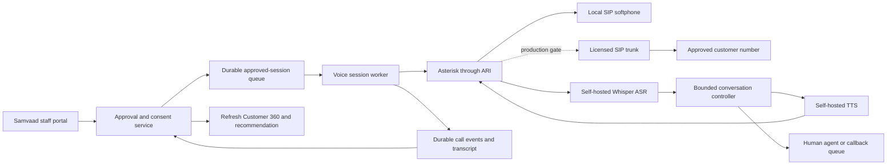

# Self-hosted telecalling and voice plan

Prepared 5 October 2026, IST. Continue building and testing locally; there is
no Snowflake connection in this phase. This document describes the production
path and its remaining gates. It is not a claim that a carrier-connected
telecalling system is deployed.

## Delivery architecture

Use the existing Samvaad action/approval service as the decision authority.
Add a durable voice-session worker, a separate PBX process, and independent
ASR/TTS providers. In the local lab, browser microphone/audio or a SIP
softphone is sufficient; a PSTN carrier is only needed for real phone calls.

Asterisk ARI provides channel/bridge control and JSON events through a
WebSocket. Keep it behind the application server; staff browsers should not
receive PBX credentials or call ARI directly.
[Asterisk ARI architecture and practices](https://docs.asterisk.org/Configuration/Interfaces/Asterisk-REST-Interface-ARI/).

The PBX's external-media interface can exchange call audio with an application
service. Select and test the transport supported by the deployed Asterisk
version; do not assume arbitrary RTP frames already have the ASR provider's
format. Protect any UDP media exchange inside the private lab/service network.
[External media reference](https://docs.asterisk.org/Development/Reference-Information/Asterisk-Framework-and-API-Examples/External-Media-and-ARI/).

## Provider choices

| Layer | Local first | Production candidate | Release gate |
| --- | --- | --- | --- |
| Speech output | Installed Windows SAPI engine; WAV playback in the browser | Parler Mini v1 stock voice with T5 tokenizer; SpeechT5/HiFi-GAN is an alternative with a cleared speaker vector | Audibly evaluate English quality, number pronunciation, phone bandwidth, runtime licenses and the exact voice/tokenizer/codec assets |
| Speech input | Explicitly labeled text entry, then owned WAV/microphone input | faster-whisper/CTranslate2; small multilingual model first, then compare larger GPU models | Evaluate real English/Hindi recordings, silence, accents, background noise and important financial entities |
| Conversation | Script and bounded response states | Same controller plus a constrained response-drafting provider | No invented approval, credit decision, discount, link, delivery, or customer acceptance |
| Telephony | Browser audio or isolated SIP softphone | Asterisk ARI and a contracted SIP trunk | Carrier access, verified sender/number, permitted destinations, recorded consent and calling purpose |
| Events | Existing SQLite demo storage | Transactional operational database plus durable worker queue and recording storage | Atomic action claim, delivery reconciliation, crash recovery, replay tests and audited role checks |

The chosen ASR implementation supports CPU INT8 and GPU operation; its upstream
benchmarks are not latency measurements for this machine or telephone audio.
Use model revisions and conversions recorded in the model manifest.
[faster-whisper documentation](https://github.com/SYSTRAN/faster-whisper).

The provisional production TTS default, Parler Mini v1, has Apache-2.0-labeled weights and
uses a stock voice; the SpeechT5 alternative has MIT-labeled acoustic/vocoder
weights and needs a separately reviewed speaker vector. Runtime dependencies
and any voice assets still need deployment review.
The current Windows voice is a host feature, not the production neural provider.
See [voice-license-review.md](voice-license-review.md) for the evidence and
Kokoro and other alternatives. Mini v1.1 remains disabled until its Llama-2-derived
tokenizer asset terms are resolved.

## A call is a separate execution session

Preserve action states, and add session states rather than equating a connected
call with a successful business outcome:

`QUEUED -> CLAIMED -> DIALING -> ANSWERED -> IDENTITY_CHECK -> CONVERSING -> ENDED`

Additional states include `NO_ANSWER`, `FAILED`, `CANCELLED`, `HANDOFF`, and
`REVIEW_REQUIRED`. Keep `business_outcome` separate: interested, declined,
callback requested, opt-out, already paid, or unknown. An AI summary must not
manufacture an acceptance event.

Store session ID, action ID, attempt ID, provider call ID, consent/policy
snapshot, worker lease, timestamps, language, template/version, delivery mode,
and source event IDs. Make the call claim atomic. Persist carrier events before
acknowledging them; process repeated/out-of-order events idempotently. Recover
leases after crashes and reconcile any ambiguous dial request with the PBX
before attempting another call.

## Conversation controls

1. **Before dialing:** check the authenticated runner, current action approval,
   frozen terms, consent/DND and campaign purpose, customer number mapping,
   contact window, retries, model readiness and approved destination list.
   The service must enforce these gates, not only a CoCo hook or UI button.
2. **Greeting:** identify the organization and automated assistant. State the
   purpose and applicable recording notice; allow declining, opting out, or
   requesting a person. Keep recording disabled until its required permission
   and policy are satisfied.
3. **Identity:** a name or keypress is not identity verification. Before
   disclosing balances or individualized terms, use the organization's approved
   authentication process or hand over to a verified agent/customer session.
   Do not ask for bank passwords, card PINs, or sensitive credentials in speech.
4. **Dialogue:** use a bounded action script. Repeat and confirm recognized
   amounts, dates, rate changes and preferences. On low confidence, unsupported
   language, conflicting facts, silence or repeated confusion, offer a human
   callback rather than inventing a response.
5. **Human handoff:** transfer to an available agent with a concise transcript
   and action context. If no agent is available, record a callback request and
   its time preference; do not claim a transfer succeeded before PBX confirmation.
6. **Opt-out:** stop promotional dialogue promptly, persist the preference,
   cancel affected queued contacts, and acknowledge after persistence. Separate
   promotional consent from necessary service-contact policy in the production
   data model; the local demo currently suppresses all contact conservatively.
7. **Close the loop:** save borrower and assistant turns with speaker identity,
   mark ASR confidence/source and recording authorization, extract borrower
   signals, refresh Customer 360, and invalidate an old offer if eligibility
   changes. Financial changes still require an authorized human approval.

In production, never send a real payment or loan link merely because an LLM
asks to. A token link comes from the approved action service and passes the
same expiry, consent, replay and asset-scope gates already exercised locally.

## India carrier gate

These are scoped requirements to verify with the selected carrier for the
actual lender/insurer and calling purpose, not a complete legal-compliance
opinion:

- TRAI's February 2025 amendment requires registered senders/allocated number
  resources for commercial communications, and advance written notification
  to the originating access provider of auto-dialer/robocall use and purpose.
- Its explanatory analysis distinguishes promotional calls using the 140
  series from service/transactional calls using designated resources such as
  1600; apply the correct consent/preferences process instead of relabeling a
  top-up marketing call as a service call.
  [TRAI regulation and analysis](https://www.trai.gov.in/sites/default/files/2025-02/Regulation_12022025.pdf).
- TRAI's BFSI directions set sector-specific adoption dates for 1600. The
  November 2025 announcement covers banks and specified financial entities;
  a December direction requires IRDAI-regulated entities to adopt it by
  15 February 2026. Confirm the actual lender's category and current allocation
  with its access provider.
  [BFSI direction announcement](https://www.trai.gov.in/sites/default/files/2025-11/PR_No.135of2025.pdf),
  [insurance direction announcement](https://www.pib.gov.in/PressReleasePage.aspx?PRID=2205350).
- Customer consent must use the applicable registered process. An internal
  checkbox alone is not proof of carrier-side authorization.
  [TRAI sender guidance](https://www.trai.gov.in/advice-to-senders).

Self-hosting removes a voice-platform dependency; it does not eliminate
carrier charges, number allocation, sender registration, speaker rights,
recording/data obligations, or applicable sector rules. The local 08:00-19:00
window and four-hour/three-attempt limits are fictional demo policies, not a
claim that they are the complete legal rules for every call type.

## Step-by-step release gates

| Step | Deliverable | Check / stop condition |
| --- | --- | --- |
| 1. Local audio | Approved script → real WAV → browser playback, with actual provider shown | Audio generation must fail visibly if no provider is ready; no silent simulated success |
| 2. Local ASR | Owned microphone/WAV recording → transcript → Customer 360 interaction | Reject unsupported/broken input; evaluate silence and noisy speech; keep speakers separated |
| 3. Voice session lab | Bounded dialogue, turn log, callback/opt-out and closing-loop update | Same role/approval/consent gates; opt-out and hardship invalidate pending growth actions |
| 4. Neural provider benchmark | Pinned Parler Mini v1/Whisper environment and reviewed stock voice; optional SpeechT5 alternative | Quality/license inventory for weights/tokenizer/codec/runtime, WAV format checks and measured latency on target hardware |
| 5. PBX-only lab | SIP softphone on a private network; no carrier credentials | Answer, DTMF, audio, hangup, handoff, crash/replay and duplicate-origination tests |
| 6. Carrier readiness | Contracted SIP trunk, allocated number and sender onboarding | Carrier confirms permitted automated-call objective and exact recipient/consent process |
| 7. Controlled external pilot | One explicitly approved team recipient and recording policy | Reconcile actual call events; show real/simulated labels correctly; no arbitrary customer dialing |
| 8. Production rollout | Operational database, durable queues, identity, observability and support process | Load/recovery testing, notices/assets archived, approved telecom/data policies and pilot acceptance |

Snowflake migration is independent of the voice lab. Keep application-service
contracts stable so the data repository and AI providers can be swapped later.

## Measurement and cost

Record the hardware, model hashes, language, number of sessions and p50/p95 for
ASR endpoint-to-transcript, TTS first-audio, full response, handoff, queue wait,
and call-event ingestion. Measure real-time factor as synthesis/transcription
seconds divided by audio seconds; report warm and cold starts separately.

Evaluate at least 20 consenting test recordings per initial language with
telephone-bandwidth/noise variants. Check word error rate and, separately,
critical entities (amounts, dates, percentage/rate cuts, opt-outs). An ASR word
error rate alone does not establish safe financial conversation behavior.

Use a cost worksheet with actual carrier minutes/number rental/onboarding,
CPU/GPU hours, worker idle capacity, storage/retention, operations and human
handoff effort. Proposed latency and cost targets need measurements; no
zero-cost or realtime production promise is made from library benchmarks.

## Current leftovers

Local audio has been exercised with a real installed SAPI engine and the pinned
Whisper-base model. The synthetic test sentence, including "do not call me
again", was transcribed exactly; one cold CPU transcription took 3.388 seconds.
The saved report is `output/local-voice-check.json` and its audio is
`output/voice-sample.wav`. This is a single local smoke check, not a benchmark
of customer calls, phone bandwidth, noisy speech or production concurrency.

Parler Mini v1 is the provisional production TTS selection. Mini v1.1 is disabled
pending resolution of tokenizer asset terms. The selected v1 deployment
benchmark, carrier-connected worker and license/SBOM gate remain pending. No
actual calls or production TTS/SIP credentials were activated by this task;
local Whisper provisioning is a separate implementation activity. Runtime
checks for the locally implemented voice features must come from their test
report. `infra/voice/` contains a disabled deployment/asset
scaffold and is not a deployed PBX.
